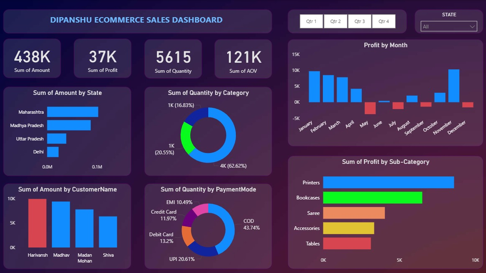

# Madhav Ecommerce Sales Dashboard – Power BI Project

## 📌 Project Overview

This project focuses on building an **interactive Power BI dashboard** to analyze ecommerce sales performance and profitability. The dashboard provides a consolidated view of revenue, profit, customer behavior, product performance, and payment trends to support strategic business decisions.

The project highlights expertise in **Power BI, DAX, Power Query, and data storytelling**.

---

## 🎯 Business Objectives

* Track overall sales, profit, quantity sold, and average order value (AOV)
* Identify top-performing states, customers, and product categories
* Analyze monthly and quarterly profit trends
* Understand customer payment preferences
* Detect loss-making products and seasonal performance gaps

---

## 🛠️ Tools & Technologies

* **BI Tool:** Power BI
* **Data Modeling:** DAX
* **Data Transformation:** Power Query
* **Data Source:** CSV / Excel (Ecommerce sales data)
* **Visualization:** KPI cards, bar charts, donut charts, slicers

---

## 📊 Dashboard Features

* **KPI Cards:** Total Revenue, Total Profit, Quantity Sold, AOV
* **State-wise Sales Analysis:** Identify top revenue-generating regions
* **Category & Sub-Category Analysis:** Quantity and profit contribution
* **Monthly Profit Trend:** Detect seasonality and loss periods
* **Customer Analysis:** Top customers by sales contribution
* **Payment Mode Analysis:** COD, UPI, Credit/Debit, EMI distribution
* **Interactive Filters:** Quarterly slicers and global dashboard filters

---

## 🔄 Project Workflow

1. Imported raw ecommerce data into Power BI
2. Cleaned and transformed data using Power Query
3. Built a star-schema data model for performance
4. Created calculated measures using DAX
5. Designed an interactive and executive-friendly dashboard
6. Validated insights for business relevance

---

## 📈 Key Insights

* **Clothing category** accounted for the highest quantity sold (~60%+)
* **COD and UPI** dominated payment methods (~65% of transactions)
* Identified **peak profit months (January & November)**
* Detected **loss-making months and sub-categories** requiring optimization
* Top states contributed majority of total revenue

---

## 🚀 Results & Impact

* Analyzed **₹438K+ revenue and ₹37K+ profit** across ecommerce transactions
* Reduced reporting effort by **40%** through automated visuals and slicers
* Delivered insights supporting **pricing, marketing, and inventory decisions**

---
## 📊 Dashboard Preview

---
## 🔮 Future Enhancements

* Integration with live databases
* Drill-through reports for customer and product-level analysis
* Deployment via Power BI Service with scheduled refresh

---

## 📜 License

This project is licensed under the MIT License.

---

## 🙏 Acknowledgments

* Ecommerce sales dataset
* Inspiration from real-world retail BI dashboards
